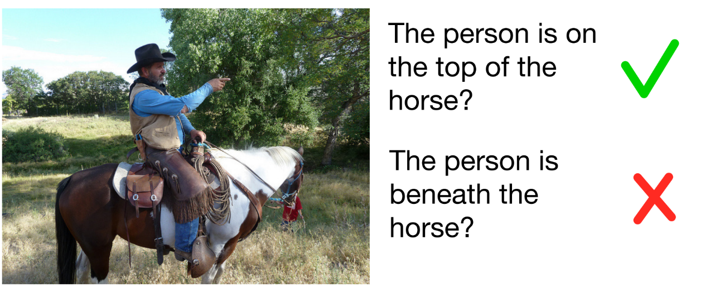
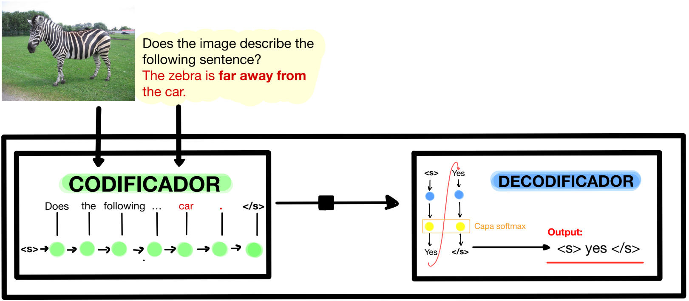
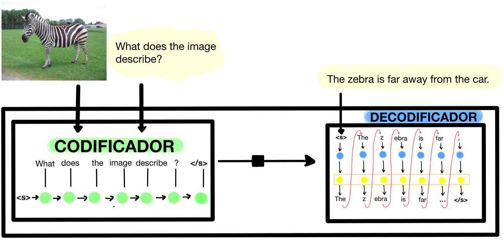

# Evaluación del conocimiento espacial de los modelos multimodales
Nuestro estudio se basa en el modelo multimodal OFA (One-for-All), un modelo entrenado para diversas tareas de visión y texto, tanto de manera independiente como combinada. OFA ha 
demostrado ser competente en tareas específicas para las que ha sido entrenado. No obstante, queremos investigar su desempeño en una tarea nueva, pero conceptualmente similar a otras 
que ya ha manejado: la identificación y descripción de relaciones espaciales.
Por tanto, este estudio se estructura en varias etapas clave. En primer lugar, se ha diseñado un conjunto de datos específicamente para evaluar la comprensión de relaciones espaciales para el modelo seleccionado. A continuación, se somete a OFA a este conjunto de datos, aplicando diversos métodos y criterios de evaluación para medir su desempeño. Finalmente, se analizan y discuten los resultados obtenidos, subrayando las limitaciones actuales de los modelos multitarea, sobretodo en tareas de relaciones espaciales.

## DATASET 
Comenzaremos obteniendo nuestras instancias del conjunto de datos VSR (Visual Scene Representation). A continuación, realizaremos un filtrado y adaptaremos los datos según nuestras necesidades para el proyecto en cuestión.

En el conjunto de datos original de VSR, cada instancia cuenta con diversos atributos, como "imagen", "link_imagen", "caption", etc. Nuestro primer paso será filtrar estas instancias y seleccionar únicamente aquellas que tengan la etiqueta (label) igual a 1. Posteriormente, nos quedaremos solamente con los atributos necesarios para nuestro análisis, descartando aquellos que no son relevantes. Además, añadiremos un par de atributos adicionales, como la relación opuesta a la que se describe en la leyenda original, junto con su respectiva descripción.

Nuestro dataset se guardará en la variable **filtro**.

## MODELO - OFA
Preparación del modelo. Se utilizará OFA-base principalmente.

# Objetivo
Vamos a evaluar nuestro conjunto de datos en el framework de aprendizaje automático OFA (One-for-All) en nuestro dataset especializado en analizar capacidad espacial en modelos multimodales.

Vamos a realizar 2 maneras diferentes de evaluación con diferentes criterios en cada una.

--------------------------------------------------------------------------
--------------------------------------------------------------------------

## 1. ITM (Image Text Matching)

Queremos ver si OFA puede entender si el caption corresponde a una imagen específica. Para lograr eso, para cada imagen que disponemos, introduciremos tanto la imagen real como su descripción correspondiente, que incluye una relación espacial que describe adecuadamente la imagen. El modelo debería decirnos "yes" si el caption coincide correctamente con la imagen.

Para asegurarnos de que el modelo realmente comprende la relación entre la imagen y el caption, repetiremos este proceso, pero esta vez introduciremos una descripción que no corresponde realmente a la imagen. Esta vez, usamos la misma imagen pero con un caption diferente que no describe la imagen correctamente. En este caso, el modelo debería decirnos "no".

Primeramente, probamos nuestro dataset con el modelo y extraemos las características necesarias para su análisis.

### 1.1. Generación de "YES"/"NO"
En este criterio solamente nos fijaremos en la salida si es YES o  NO. Guardaremos las veces que acierta y cuando no. También las veces que el modelo responde algo ajeno a lo buscado.
### 1.2. Probabilidades
Aquí nos centraremos en los logits que genera el modelo, para posteriormente analizar las probabilidades de salir "YES" o "NO" en la primera palabra que genera el modelo.
### 1.3. Probabilidades normalizadas
Exactamente igual que el caso anterior, pero ahora normalizamos las probabilidades.

--------------------------------------------------------------------------
--------------------------------------------------------------------------

## 2. Image Captioning

En esta segunda evaluación, E nos vamos a centrar en la probabilidad de determinar una secuencia ya pregenerada,
es decir nuestra caption correcta.

Por tanto el objetivo aquí es determinar qué caption (correcta o incorrecta) tiene mayor probabilidad de ser seleccionada por el modelo, basándose en las métricas obtenidas: probabilidad media de la
frase pregenerada y suma de logits.

### 2.1. Comparación de probabilidades medias

### 2.2. Comparación de multiplicación probabilidades

### 2.3. - 2.4. Análisis de la suma de logits

Por tanto, si todas las métricas (probabilidad media, multiplicación de probabilidades y suma de logits)

favorecen a la caption correcta, se puede concluir con alta confianza que el modelo tiene mayor probabilidad de seleccionar la caption correcta.

Por otro lado, si ambas métricas favorecen a la caption incorrecta, se puede concluir con alta confianza que el modelo tiene mayor probabilidad de seleccionar la caption incorrecta.

--------------------------------------------------------------------------
--------------------------------------------------------------------------

Durante los análisis, registraremos el número de Verdaderos Positivos (TP), Falsos Negativos (FN), Verdaderos Negativos (TN) y Falsos Positivos (FP), con el fin de construir posteriormente una matriz de confusión. No obstante el accuracy y número de aciertos en función por su relación y tipo de relación espacial.

Luego, procederemos a graficar el porcentaje de las relaciones que han sido clasificadas como TP, FN, etc., con el objetivo de identificar patrones y tendencias en el rendimiento del modelo. Además de ver cuáles son las relaciones que más difícil son de identificar para el modelo.

